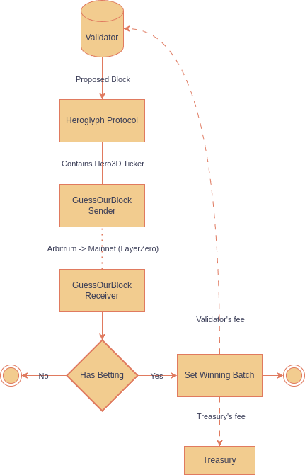

# Hero3D
**Hero3D aka "GuessOurBlock (GOB)"** is a betting game based on the Heroglyph Protocol. Players must guess which batch will be selected by a Heroglyph validator via a ticker.

## How It Works
The Heroglyph Protocol lets validators run on-chain code using their Node's graffiti. A block is considered a win if the proposer has the Hero3D ticker in their graffiti.

## Winning Probability
With approximately 6.4 Heroglyph blocks per day and 7200 blocks in total, one guess contains 100 blocks. Assuming all Heroglyph validators use the Hero3D ticker, your chance of winning is:
##### $1-(71/72)^{6.4} *100 ≈ 8.7$%

## How to Play
Make guesses in multiples of 100 blocks. Choose an Ethereum block number and hope that one of the block producers is a Heroglyph validator with the ticker.

